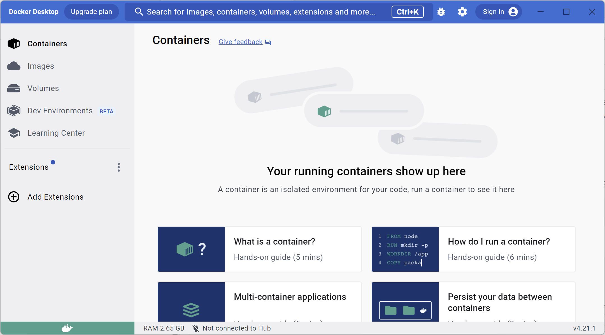
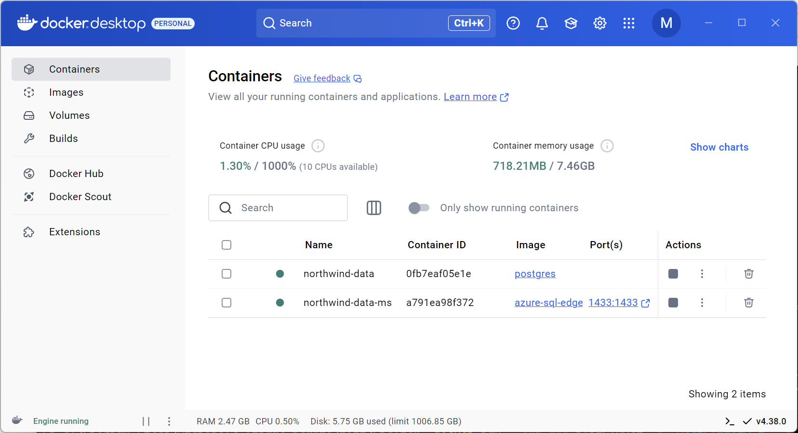
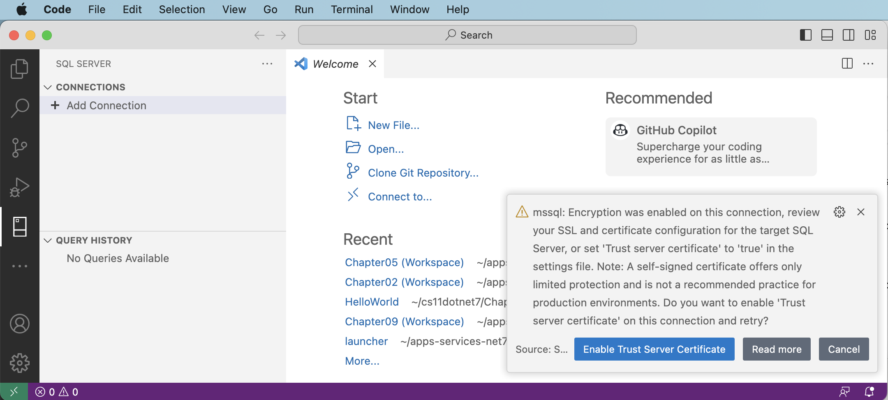
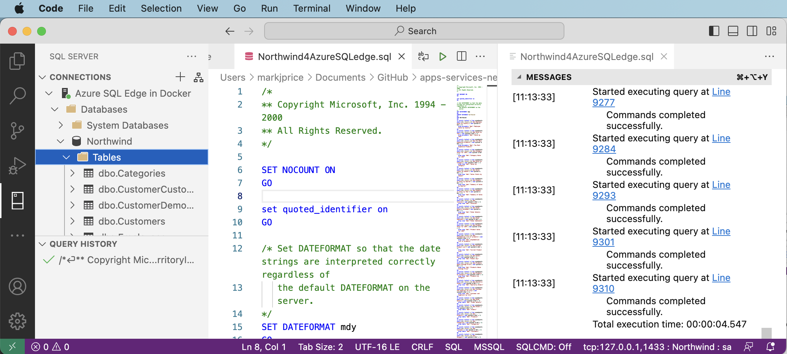
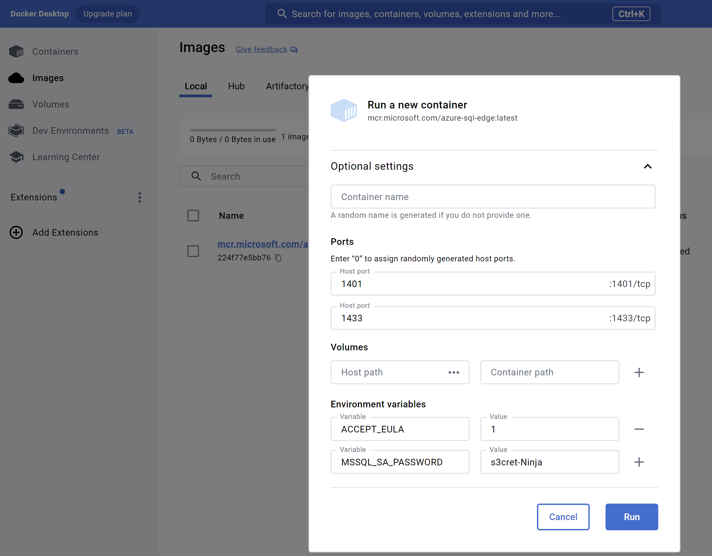

**Installing Azure SQL Edge in Docker**

- [Installing Docker and the Azure SQL Edge container image](#installing-docker-and-the-azure-sql-edge-container-image)
- [Run the Azure SQL Edge container image](#run-the-azure-sql-edge-container-image)
- [Connecting to Azure SQL Edge in a Docker container](#connecting-to-azure-sql-edge-in-a-docker-container)
  - [Connecting from Visual Studio 2022](#connecting-from-visual-studio-2022)
  - [Connecting from Visual Studio Code](#connecting-from-visual-studio-code)
- [Creating the Northwind database using a SQL script](#creating-the-northwind-database-using-a-sql-script)
- [Removing Docker resources](#removing-docker-resources)
- [Running a container using the user interface](#running-a-container-using-the-user-interface)

# Installing Docker and the Azure SQL Edge container image

If you do not have a Windows computer, and you do not want to pay for Azure resources, then you can install Docker and use a container that has Azure SQL Edge, a cross-platform minimal featured version of SQL Server that only includes the database engine. 

The Docker image we will use has Azure SQL Edge based on Ubuntu 18.4. It is supported with the Docker Engine 1.8 or later on Linux, or on Docker for Mac or Windows. Azure SQL Edge requires a 64-bit processor (either x64 or ARM64), with a minimum of one processor and 1 GB RAM on the host.

1.	Install **Docker Desktop** from the following link: https://docs.docker.com/engine/install/.
2.	Start **Docker Desktop**, as shown in Figure 2A.1:


*Figure 2A.1: Docker Desktop v4.21.1 (July 2023) on Windows*

3.	At the command prompt or terminal, pull down the latest container image for Azure SQL Edge, as shown in the following command:
```
docker pull mcr.microsoft.com/azure-sql-edge:latest
```
4.	Wait for the image as it is downloading, as shown in the following output:
```
latest: Pulling from azure-sql-edge
a055bf07b5b0: Pull complete
cb84717c05a1: Pull complete
35d9c30b7f54: Downloading [========================>                          ]  20.46MB/42.55MB
46be68282524: Downloading [============>                                      ]  45.94MB/186MB
5eee3e29ad15: Downloading [======================================>            ]  15.97MB/20.52MB
15bd653c6216: Waiting
d8d6247303da: Waiting
c31fafd6718a: Waiting
fa1c91dcb9c8: Waiting
1ccbfe988be8: Waiting
```
5.	Note the results, as shown in the following output:
```
latest: Pulling from azure-sql-edge
2f94e549220a: Pull complete
830b1adc1e72: Pull complete
f6caea6b4bd2: Pull complete
ef3b33eb5a27: Pull complete
8a42011e5477: Pull complete
f173534aa1e4: Pull complete
6c1894e17f11: Pull complete
a81c43e790ea: Pull complete
c3982946560a: Pull complete
25f31208d245: Pull complete
Digest: sha256:7c203ad8b240ef3bff81ca9794f31936c9b864cc165dd187c23c5bfe06cf0340
Status: Downloaded newer image for mcr.microsoft.com/azure-sql-edge:latest
mcr.microsoft.com/azure-sql-edge:latest
```

# Run the Azure SQL Edge container image

1.	At the command prompt or terminal, run the container image for Azure SQL Edge with a strong password and name the container `azuresqledge`, as shown in the following command:
```
docker run --cap-add SYS_PTRACE -e 'ACCEPT_EULA=1' -e 'MSSQL_SA_PASSWORD=s3cret-Ninja' -p 1433:1433 --name azuresqledge -d mcr.microsoft.com/azure-sql-edge
```

> **Good Practice**: The password must be at least 8 characters long and contain characters from three of the following four sets: uppercase letters, lowercase letters, digits, and symbols; otherwise, the container cannot set up the SQL Edge engine and will stop working.

> On Windows 11, running the container image at the command prompt failed for me. See [here](#running-a-container-using-the-user-interface) for steps that worked.

2.	If your operating system firewall blocks access, then allow access.
3.	In **Docker Desktop**, in the **Containers** section, confirm that the image is running, as shown in *Figure 2A.2*:


*Figure 2A.2: Azure SQL Edge running in Docker Desktop on an Apple Silicon Mac*

9.	At the command prompt or terminal, ask Docker to list all containers, both running and stopped, as shown in the following command:
```
docker ps -a
```

10.	Note the container is **"Up"** and listening externally on port 1433, which is mapped to its internal port 1433, as shown highlighted in the following output:
```
CONTAINER ID   IMAGE                              COMMAND                  CREATED         STATUS         PORTS                              NAMES
183f02e84b2a   mcr.microsoft.com/azure-sql-edge   "/opt/mssql/bin/perm…"   8 minutes ago   Up 8 minutes   1401/tcp, 0.0.0.0:1433->1433/tcp   azuresqledge
```

You can learn more about the `docker ps` command at the following link: https://docs.docker.com/engine/reference/commandline/ps/.

# Connecting to Azure SQL Edge in a Docker container

Use your preferred database tool to connect to Azure SQL Edge in the Docker container.

Some differences in the database connection string:

- **Data Source** aka **server**: `tcp:127.0.0.1,1433`
- Must use **SQL Server Authentication** aka **SQL Login** i.e. you must supply a user name and password. Azure SQL Edge image has the `sa` user already created and you had to give it a strong password when you ran the container. We chose the password `s3cret-Ninja`.
- **Database**: `master` or leave blank. We will create the Northwind database using a SQL script.

## Connecting from Visual Studio 2022 

1.	In Visual Studio 2022, navigate to **View** | **Server Explorer**.
2.  In the mini-toolbar, click the **Connect to Database...** button.
2.  Enter the connection details, as shown in *Figure 2A.3*:


*Figure 2A.3: Connecting to your Azure SQL Edge server from Visual Studio 2022*

## Connecting from Visual Studio Code

1. In Visual Studio Code, navigate to the **SQL** extension.
2. In the **SQL** extension, click **Add Connection...**.
3. Enter the server name `tcp:127.0.0.1,1433`, as shown in *Figure 2A.4*:


*Figure 2A.4: Specifying the server name*

4. Leave the database name blank by pressing *Enter*, as shown in *Figure 2A.5*:


*Figure 2A.5: Specifying the database name (leave blank)*

5. Select **SQL Login** so that we can enter a user ID and password, as shown in *Figure 2A.6*:


*Figure 2A.6: Choosing SQL Login to authenticate*

6. Enter the user ID `sa`, as shown in *Figure 2A.7*:


*Figure 2A.7: Entering the user ID of sa*

7. Enter the password `s3cret-Ninja`, as shown in *Figure 2A.8*:


*Figure 2A.8: Entering the password*

8. Select **Yes** to save the password for the future, as shown in *Figure 2A.9*:


*Figure 2A.9: Saving the password for future use*

9. Enter a connection profile name `Azure SQL Edge in Docker`, as shown in *Figure 2A.10*:


*Figure 2A.10: Naming the connection*

10. Click **Enable Trust Server Certificate**, as shown in *Figure 2A.11*:


*Figure 2A.11: Trusting the local developer certificate*

11. Note the success notification message, as shown in *Figure 2A.12*:


*Figure 2A.12: Success notification*

# Creating the Northwind database using a SQL script

1.	Open the `Northwind4AzureSQLedge.sql` file.
2.  Execute the SQL script:
    - If you are using Visual Studio 2022, right-click in the script, and then select **Execute**, and then wait to see the `Command completed successfully` message.
    - If you are using Visual Studio Code, right-click in the script, select **Execute Query**, select the **Azure SQL Edge in Docker** connection profile, and then wait to see the `Commands completed successfully` messages.
3.	Refresh the data connection:
    - If you are using Visual Studio 2022, then in **Server Explorer**, right-click **Tables** and select **Refresh**.
    - If you are using Visual Studio Code, then right-click the **Azure SQL Edge in Docker** connection profile and choose **Refresh**.
4.  Expand **Databases**, expand **Northwind** and then expand **Tables**.
5.  Note that 13 tables have been created, for example, `Categories`, `Customers`, and `Products`. Also note that dozens of views and stored procedures have also been created.


*Figure 2A.14: Northwind database created by SQL script in Visual Studio Code*

You now have a running instance of Azure SQL Edge containing the Northwind database that you can connect to from a console app.

# Removing Docker resources

If you have completed all the chapters in the book, or plan to use full SQL Server or Azure SQL Database, and now want to remove all the Docker resources, then follow these steps:

1.	At the command prompt or terminal, stop the `azuresqledge` container, as shown in the following command:
```
docker stop azuresqledge
```

2.	At the command prompt or terminal, remove the `azuresqledge` container, as shown in the following command:
```
docker rm azuresqledge
```

> **Warning!** Removing the container will delete all data inside it.

3.	At the command prompt or terminal, remove the `azure-sql-edge` image to release its disk space, as shown in the following command:
```
docker rmi mcr.microsoft.com/azure-sql-edge
```

# Running a container using the user interface

If entering a command at the prompt or terminal fails for you, try following these steps to use the user interface:

1. In **Docker Desktop**, navigate to the **Images** tab.
2. In the **mcr.microsoft.com/azuresqledge** row, click the **Run** action.
3. In the **Run a new container** dialog box, expand **Optional settings**, and complete the configuration, as shown in *Figure 2A.15* and in the following items:
    - Container name: `azuresqledge`, or leave blank to use a random name.
    - Ports:
        - Enter `1401` to map to **:1401/tcp**.
        - Enter `1433` to map to **:1433/tcp**.
    - Volumes: leave empty.
    - Environent variables (click + to add a second one):
        - Enter `ACCEPT_EULA` with value `Y` (or `1`).
        - Enter `MSSQL_SA_PASSWORD` with value `s3cret-Ninja`.
4. Click **Run**.


*Figure 2A.15: Running a container for Azure SQL Edge with the user interface*
